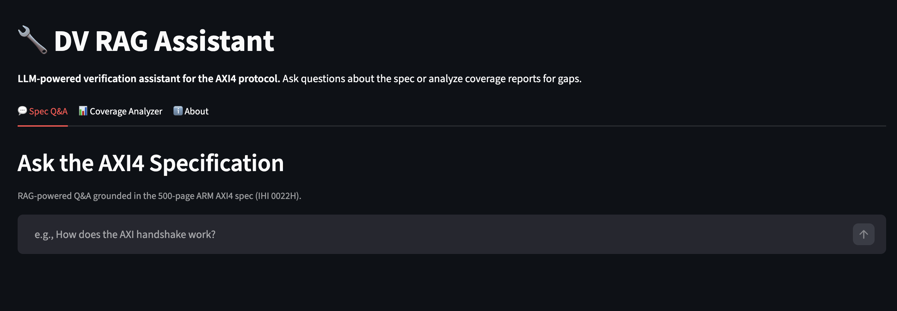
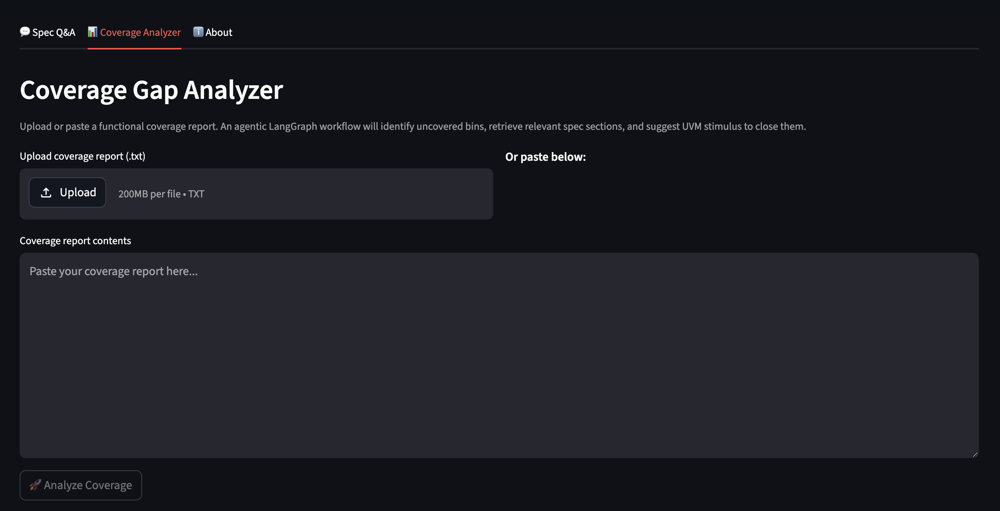
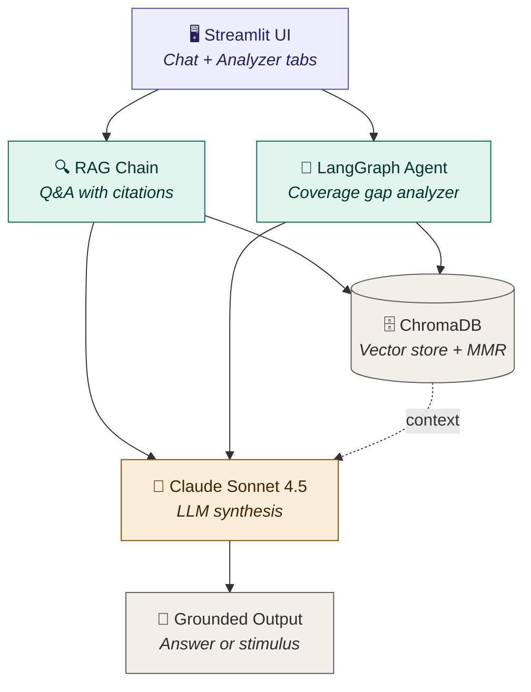
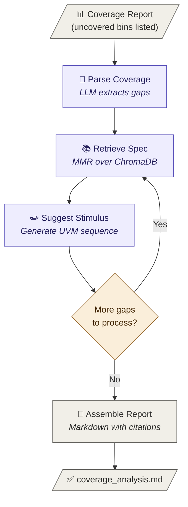

# 🔧 DV RAG Assistant

> An LLM-powered verification assistant for the AXI4 protocol.
> Ask the spec questions in plain English, or upload a coverage report and let an agent suggest UVM stimulus to close the gaps.

[](https://www.python.org/)
[](https://www.langchain.com/)
[](https://langchain-ai.github.io/langgraph/)
[](https://streamlit.io/)
[](https://www.anthropic.com/)

---

## 📋 Overview

Modern Design Verification (DV) engineers spend hours hunting through 500-page protocol specifications and analyzing coverage reports for missed scenarios. **This project automates both.**

Two capabilities, one system:

1. **Spec Q&A** — Conversational RAG (Retrieval-Augmented Generation) over the ARM AXI4 specification. Ask any question, get answers grounded in the actual spec with page citations.
2. **Coverage Gap Analyzer** — A LangGraph agent that parses functional coverage reports, identifies uncovered bins, retrieves relevant spec context for each gap, and suggests concrete UVM constrained-random stimulus to close them.

---

## 🎬 Demo


| Spec Q&A | Coverage Analyzer |
|----------|-------------------|
|  |  |

---

## 🏗️ Architecture

### System Architecture



### Coverage Analyzer Agent (LangGraph)



The agent is implemented as a stateful `StateGraph` — the loop between `Retrieve` and `Suggest` runs once per identified coverage gap, with conditional branching back via `add_conditional_edges`.

### RAG Pipeline
```
PDF (500 pages)
   ↓ PyPDFLoader + custom regex preprocessing
Cleaned pages (boilerplate stripped, front matter dropped)
   ↓ RecursiveCharacterTextSplitter (1500 chars, 300 overlap)
Semantic chunks (~865 chunks)
   ↓ HuggingFace all-MiniLM-L6-v2 (local embedding)
384-dim vectors
   ↓ ChromaDB (persistent on-disk)
Searchable vector store
   ↓ MMR retrieval (k=10, fetch_k=25, λ=0.5)
Diversified context
   ↓ Claude Sonnet 4.5 + grounded prompt
Answer with page citations
```

### Coverage Agent (LangGraph)
```
Coverage Report
     ↓
[Parse] → identify uncovered bins
     ↓
┌──→ [Retrieve] → fetch relevant spec context
│         ↓
│    [Suggest] → generate UVM stimulus
│         ↓
└─── (loop until all gaps processed)
          ↓
     [Assemble] → final markdown report
```

The agent is implemented as a stateful `StateGraph` with conditional edges — a real multi-step agentic workflow, not a sequential pipeline.

---

## 🛠️ Tech Stack

| Layer | Tool |
|-------|------|
| LLM | Anthropic Claude Sonnet 4.5 |
| RAG framework | LangChain 1.x |
| Agent framework | LangGraph |
| Vector DB | ChromaDB (persistent) |
| Embeddings | sentence-transformers `all-MiniLM-L6-v2` (local, free) |
| PDF parsing | PyPDF + custom regex preprocessing |
| UI | Streamlit |
| Language | Python 3.11+ |

**Why these choices:**
- **Local embeddings** keep ingestion free and the spec on your machine
- **MMR over similarity search** prevents top-k from being 8 near-duplicate chunks
- **LangGraph over LangChain agents** for explicit, debuggable state transitions
- **ChromaDB over Pinecone/Weaviate** for zero-infra local development

---

## 🚀 Quick Start

### 1. Clone & install
```bash
git clone https://github.com/Dhirajzen/dv-rag-assistant.git
cd dv-rag-assistant
python -m venv venv
source venv/bin/activate          # macOS/Linux
# venv\Scripts\activate           # Windows
pip install -r requirements.txt
```

### 2. Set up your API key
Create a `.env` file in the project root:
```bash
ANTHROPIC_API_KEY=sk-ant-your-key-here
```
Get a key at [console.anthropic.com](https://console.anthropic.com).

### 3. Add the AXI4 spec
Download the AMBA AXI Protocol Specification (free with signup) from [ARM Developer](https://developer.arm.com/documentation/ihi0022/) and save as:
```
data/axi4_spec.pdf
```

### 4. Build the vector database
```bash
python ingest.py
```
This loads the PDF, cleans it, chunks it, embeds it, and persists to `chroma_db/`. Takes ~3 minutes.

### 5. Run the app
```bash
streamlit run app.py
```

Or run from the CLI:
```bash
python rag.py     # interactive Spec Q&A
python agent.py   # run coverage gap analyzer
```

---

## 📁 Project Structure

```
dv-rag-assistant/
├── app.py                # Streamlit UI (Q&A + coverage analyzer tabs)
├── ingest.py             # PDF → chunks → embeddings → ChromaDB
├── rag.py                # RAG retrieval chain with MMR + grounded prompts
├── agent.py              # LangGraph agent for coverage gap analysis
├── test_llm.py           # Sanity check for API connectivity
├── test_retrieval.py     # Inspect retrieval quality
├── requirements.txt
├── .env                  # (not committed) API key
├── data/
│   ├── axi4_spec.pdf     # (not committed) ARM AXI4 spec
│   └── coverage_report.txt   # sample functional coverage report
├── chroma_db/            # (not committed) vector DB, generated by ingest.py
└── README.md
```

---

## 🧠 Engineering Decisions & Challenges

A short post-mortem of the non-obvious problems hit while building this — the actual interesting parts.

### Problem 1: Table of contents was outranking real content
**Symptom:** Asking "Describe the AXI handshake protocol" returned chunks from the TOC ("Chapter A3 describes the basic AXI protocol transaction requirements...") because TOC entries were lexically similar to natural-language queries.
**Fix:** Skip first ~30 pages of front matter during ingestion.

### Problem 2: Page headers/footers polluting chunks
**Symptom:** Top retrieved chunks were mostly "ARM IHI 0022H Copyright © 2003-2020..." boilerplate.
**Fix:** Custom regex preprocessing to strip recurring copyright lines and page numbers before chunking. Drop chunks that became <100 chars after cleaning.

### Problem 3: Top-k retrieval returning near-duplicate chunks
**Symptom:** Asking about AXI4-Lite handshake returned 8 chunks all from pages 118-122, missing the foundational handshake description in Chapter A3.
**Fix:** Switched from similarity search to **Maximal Marginal Relevance (MMR)** retrieval, which balances relevance with diversity (`fetch_k=25, k=10, λ=0.5`).

### Problem 4: LLM refusing to synthesize when context was partial
**Symptom:** Even with relevant chunks present, Claude would refuse with "not enough information."
**Fix:** Prompt engineering — explicitly instructed the LLM to synthesize across chunks and use partial information rather than refuse on first uncertainty.

These four are the canonical RAG challenges that every production system has to solve. Working through them was where the real learning happened.

---

## 🔮 Future Work

- Migrate from legacy `RetrievalQA` to LangChain LCEL chains
- Add reranking with `cohere` or cross-encoder models for higher-precision retrieval
- Support multiple specs (APB, AHB, AXI5) with a multi-collection vector store
- Parse real VCS/Questa URG output (not just synthetic reports)
- Generate actual SystemVerilog files instead of code sketches
- Add evaluation harness with ground-truth Q&A pairs

---

## 👤 Author

**Dhirajzen Bagawath Geetha Kumaravel**
MS Computer Engineering, NYU (May 2026)
Targeting Design Verification roles in semiconductor / hardware.

- 📧 db5309@nyu.edu
- 💼 [LinkedIn](https://linkedin.com/in/dhirajzen30)
- 🔗 [GitHub](https://github.com/Dhirajzen)

---

## 📜 License

MIT — feel free to use, modify, and learn from.

The AXI4 specification is the property of ARM Limited and is not redistributed in this repo.
